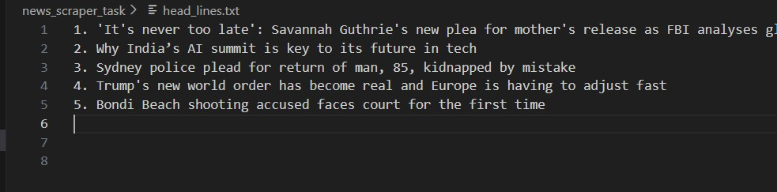

#  News Headlines Web Scraper

## Project Overview
This project is a simple Python web scraper that extracts top news headlines
from a public news website using Python libraries. The headlines are saved
automatically into a text file.

## Technologies Used
- Python
- Requests library
- BeautifulSoup (bs4)
- VS Code
- GitHub

## How It Works
1. Sends HTTP request to a news website.
2. Gets HTML content.
3. Extracts headlines using BeautifulSoup.
4. Saves them into head_lines.txt file.

## How to Run

Install libraries:
pip install requests beautifulsoup4

Run the program:
python news_scraper.py

## Project Files
- news_scraper.py → Python scraper code
- head_lines.txt → Output headlines
- output.png → Screenshot (optional)
- README.md → Documentation

## Output Screenshot

